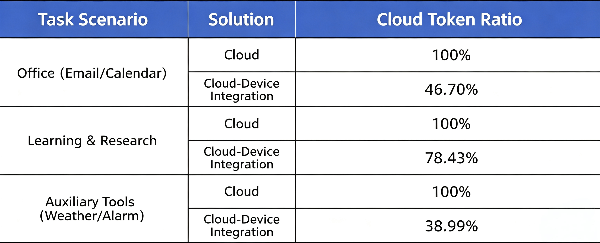
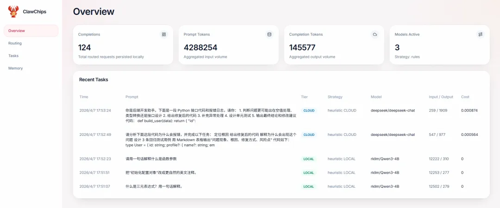
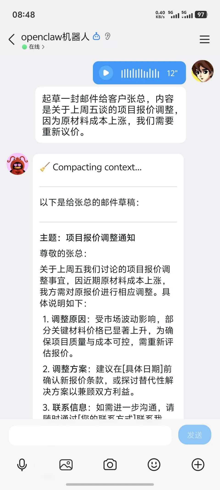

# ClawChips: Introduction & Deployment Guide

**English** | [**简体中文**](locales/README.zh-CN.md)

## What is ClawChips?

ClawChips is an "on-device intelligent routing plugin solution." Deployed on Rockchip edge devices, it integrates local models, cloud models, memory routing, and a visual operations dashboard. This makes the Lobster Agent more cost-effective, practical, and controllable on the edge. Compared to approaches that rely entirely on cloud models, ClawChips dynamically routes requests between local and cloud processing based on task complexity, significantly increasing the proportion of locally handled tasks. This means high-frequency, lightweight, and latency-sensitive tasks are prioritized for local execution, reducing unnecessary cloud call pressure and allowing cloud resources to be dedicated to complex reasoning and high-quality generation.

### Overall Architecture Composition
The architecture consists of three core modules: RK1828 Co-processor Chip, RK3588 Main Control Chip, and Cloud Server (LLM Token Package), forming a complete end-cloud collaborative computing system.

#### 1. RK1828 (Co-processor Chip)
Core Capabilities:
- Local LLM inference on end devices
- High bandwidth & high performance
- Efficient adaptation for 4B parameter models
- Private data processing
- Local execution of lightweight tasks

#### 2. RK3588 (Main Control Chip)
Core Capabilities:
- Runtime environment for Agent applications
- Perception input & execution output management
- Private data storage
- General-purpose development base platform

#### 3. Cloud Server (LLM Token Package)
Core Capabilities:
- Cloud-side large model inference
- In-depth reasoning with long context windows
- Planning & scheduling for complex tasks

### Data Flow Logic
1. The RK3588 main control chip distributes lightweight computing tasks to the RK1828 co-processor for local processing.
2. The RK3588 main control chip forwards complex, high-demand tasks to the cloud server for advanced large model computation.
3. Realize end-cloud collaborative intelligent computing through two-way task scheduling.

### Background Technical Feature
The overall system is built on binary digital underlying technology, supporting full-link end-cloud AI collaborative reasoning with privacy computing capability.

### Saving Cloud Token Consumption

Equipped with a proprietary local intelligent routing mechanism, ClawChips enables highly efficient interaction cost management. Upon receiving a request, the system prioritizes reusing the memory bank. Based on PinchBench tests, it can reduce cloud model consumption by 40%, achieving zero-cost local inference and making cloud calls much more efficient.

### Simple Commands, Ready to Use Out of the Box

ClawChips has integrated and deployed multiple foundational features, balancing practicality with developer-friendliness. It comes with an initial set of both general-purpose and customer-customizable Skills. Core requirements such as device debugging, image analysis, and model testing are encapsulated into simple commands, lowering the initial barrier for developers and allowing the Lobster Agent to be used right out of the box.

### Application Scenario: Programming Assistant

In the typical programming assistant scenario, ClawChips demonstrates the synergistic advantage of "handling simple tasks locally first, and supplementing with the cloud for complex tasks." Lightweight tasks like code comment translation, short code explanations, and function naming optimization are prioritized for local execution. Meanwhile, more complex development tasks such as error troubleshooting, root cause analysis, fix suggestions, and test design leverage cloud capabilities to ensure higher processing quality. For developers, this achieves an effective balance between efficiency, cost, and capability.

### Application Scenario: Speech Recognition

Beyond edge-cloud collaboration, ClawChips features ASR (Automatic Speech Recognition) interaction capabilities, enabling rapid recognition and parsing of voice commands even in complex environments. It is highly suitable for high-frequency, natural voice interaction scenarios such as robotics, smart home systems, smart terminals, and voice-controlled devices.

## Installation Guide

### Requirements

- RK3588+RK1828 Debian/Ubuntu operating system

### Quick Start

For the full development board environment setup and installation process, see *[ClawChips_Quick_Start](https://github.com/airockchip/clawchips/blob/main/ClawChips_Quick_Start.md)*.

## License

MIT
