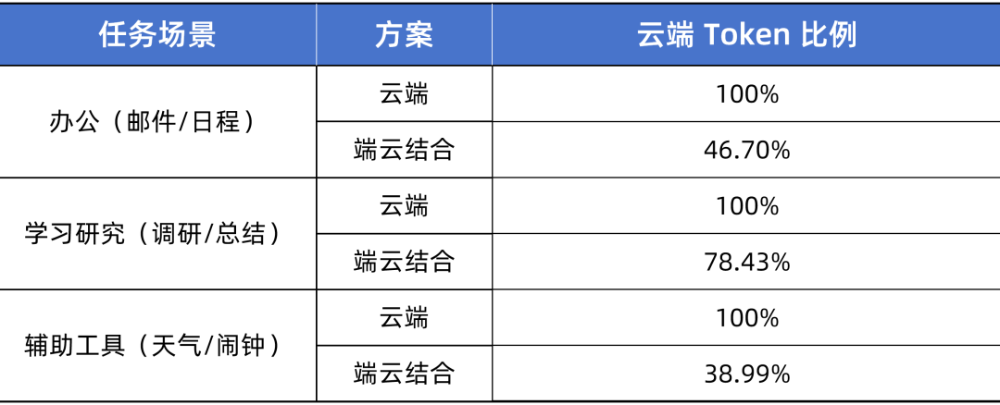

# ClawChips介绍与部署指南

## 什么是ClawChips？

ClawChips属于“端侧智能路由插件方案”，是在瑞芯微边缘设备上，把本地模型、云端模型、记忆路由和可视化运维面板整合起来，让龙虾在端侧更省钱、更实用、更可控，相较于完全依赖云端模型的处理方式，系统能够根据任务复杂度，对请求进行本地与云端分流，本地处理占比有了显著提升。这意味着一部分高频、轻量、实时性要求更高的任务，可以优先在本地完成处理，从而减少不必要的云端调用压力，让云端资源更多用于复杂理解和高质量生成等任务。

### 整体架构组成
整套架构由三大核心模块构成：RK1828协处理器芯片、RK3588主控芯片、云端服务器（大模型Token套餐），搭建完整端云协同算力体系。

#### RK1828（协处理器芯片）
核心能力：
- 端侧大模型推理
- 高带宽、高性能
- 高效适配4B参数模型
- 隐私数据处理
- 简单任务本地运行

#### RK3588（主控芯片）
核心能力：
- Agent运行环境
- 感知输入、执行输出
- 隐私数据存储
- 通用开发底座

#### 云端服务器（大模型Token套餐）
核心能力：
- 云端大模型推理
- 长上下文深度思考
- 复杂任务规划

### 数据流转逻辑
1. RK3588主控芯片将轻量化计算任务下发至RK1828协处理器，完成本地处理；
2. RK3588主控芯片将高算力、高复杂度任务上传至云端服务器，由云端大模型完成运算；
3. 通过双向任务调度，实现端云一体化协同智能计算。

### 底层技术特性
整套系统基于二进制数字底层技术搭建，全链路支持带隐私计算能力的端云协同AI推理。

### 节省云端Token消耗

ClawChips搭载自研本地智能路由机制，实现交互成本的高效管控。系统收到请求后，优先复用记忆库基于PinchBench实测，可节省40%云端模型消耗，实现本地推理零成本，云端调用更高效。

### 简易指令，龙虾开箱即用

ClawChips已完成多项基础功能的集成与落地，兼顾实用性与开发性，内置通用型+客户定制型首批Skils，将设备调试、图像分析、模型测试等核心需求封装为简易指令，降低开发者初期使用门槛，让龙虾可以到手直接使用。

### 应用场景：编程助手

在编程助手这一典型应用场景中，ClawChips展现出“简单任务本地优先、复杂任务云端补充”的协同优势。像代码注释翻译、短代码说明、函数命名优化等轻量任务，可以优先在本地完成，而对于报错排查、根因分析、修复建议、测试设计等更复杂的开发任务，则借助云端能力进一步提高处理质量。对于开发者而言，能够在效率、成本与能力之间取得有效平衡。

### 应用场景：语音识别

除了端云协同之外，ClawChips所具备的ASR语音识别交互能力，实现复杂环境下的语音指令快速识别与解析。能够适用于机器人、智能家居、智能终端、语音控制设备等高频的语音自然交互场景。

## 安装指南

### 环境要求

- RK3588+RK1828 Debian/Ubuntu操作系统

### 快速开始

完整的开发板环境搭建和安装请参考《[ClawChips快速上手指南](https://github.com/airockchip/clawchips/blob/main/ClawChips_Quick_Start.md)》

---

## License

MIT